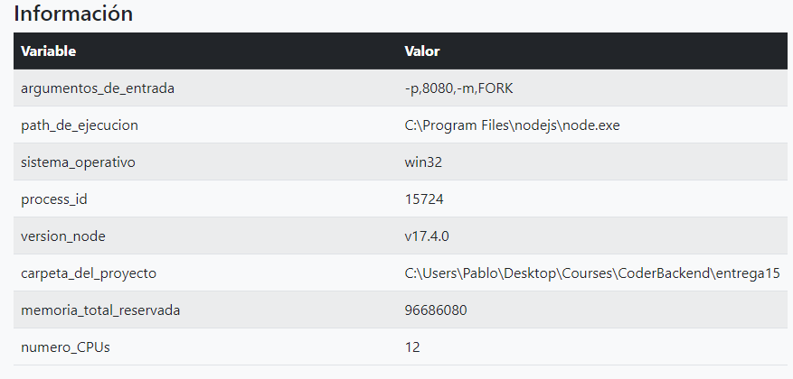

# USANDO EL OBJETO PROCESS

### Consigna
Tomando con base el proyecto que vamos realizando, agregar un parámetro más en la ruta de comando que permita ejecutar al servidor en modo fork o cluster. Dicho parámetro será 'FORK' en el primer caso y 'CLUSTER' en el segundo, y de no pasarlo, el servidor iniciará en modo fork.

- Agregar en la vista info, el número de procesadores presentes en el servidor.



- Ejecutar el servidor (modos FORK y CLUSTER) con nodemon verificando el número de procesos tomados por node.

```c
nodemon index.js -p 8080 -m FORK
```


```c
nodemon index.js -p 8080 -m CLUSTER
```


- Ejecutar el servidor (con los parámetros adecuados) utilizando Forever, verificando su correcta operación. Listar los procesos por Forever y por sistema operativo.

```c
forever start index.js  -p 8080
forever start index.js  -p 8081
forever list
forever stopall
```


- Ejecutar el servidor (con los parámetros adecuados: modo FORK) utilizando PM2 en sus modos modo fork y cluster. Listar los procesos por PM2 y por sistema operativo.

```c
pm2 start index.js --name="ServerFORK" -- -p 8081
pm2 start index.js --name="ServerCLUSTER" -i 4 -- -p 8082
pm2 delete all
```


Nota: si se quiere activar el modo cluster con pm2 se debe pasar el parámetro como *pm2 start index.js --name="ServerFORK" -- -p 8081 -m CLUSTER*

- Tanto en Forever como en PM2 permitir el modo escucha, para que la actualización del código del servidor se vea reflejado inmediatamente en todos los procesos.
- Hacer pruebas de finalización de procesos fork y cluster en los casos que corresponda.


### Consigna parte 2
Configurar Nginx para balancear cargas de nuestro servidor de la siguiente manera:

Redirigir todas las consultas a /api/randoms a un cluster de servidores escuchando en el puerto 8081. El cluster será creado desde node utilizando el módulo nativo cluster.

El resto de las consultas, redirigirlas a un servidor individual escuchando en el puerto 8080.

Verificar que todo funcione correctamente.

Modificamos el archivo nginx.conf
```javascript
events {
}

http {
    include       mime.types;
    default_type  application/octet-stream;

    upstream puerto_8080 {
        server 127.0.0.1:8080;
    }

    upstream puerto_8081 {
        server 127.0.0.1:8081;
    }

    server {
        listen       80;
        server_name  nginx_node;
        root C:\Users\Pablo\Desktop\Courses\CoderBackend\entrega15\public;

        location / {
            proxy_pass http://puerto_8080;
        }
        
        location /api/randoms {
            proxy_pass http://puerto_8081;
        }
    }
}
```

Abrimos el ejecutable
```c
nginx.exe
```

Levantamos la instancia fork y cluster en los puertos correspondientes
```c
pm2 start index.js --name="ServerFORK" -- -p 8080
pm2 start index.js --name="ServerCLUSTER" -i 4 -- -p 8081
// probamos la funcionalidad
pm2 delete all
```

Luego, modificar la configuración para que todas las consultas a /api/randoms sean redirigidas a un cluster de servidores gestionado desde nginx, repartiéndolas equitativamente entre 4 instancias escuchando en los puertos 8082, 8083, 8084 y 8085 respectivamente.

Modificamos el archivo nginx.conf
```javascript
events {
}

http {
    include       mime.types;
    default_type  application/octet-stream;

    upstream puerto_8081 {
        server 127.0.0.1:8081;
    }

    upstream puerto_8082_al_8085 {
        server 127.0.0.1:8082;
        server 127.0.0.1:8083;
        server 127.0.0.1:8084;
        server 127.0.0.1:8085;
    }

    server {
        listen       80;
        server_name  nginx_node;
        root C:\Users\Pablo\Desktop\Courses\CoderBackend\entrega15\public;

        location / {
            proxy_pass http://puerto_8081;
        }
        
        location /api/randoms {
            proxy_pass http://puerto_8082_al_8085;
        }
    }
}
```

Reiniciamos nginx
```c
nginx.exe -s reload
```

```c
pm2 start index.js --name="ServerCLUSTER" -i 4 -- -p 8081
pm2 start index.js --name="ServerFORK82" -- -p 8082
pm2 start index.js --name="ServerFORK83" -- -p 8083
pm2 start index.js --name="ServerFORK84" -- -p 8084
pm2 start index.js --name="ServerFORK85" -- -p 8085
// probamos la funcionalidad
pm2 delete all
```

### Aspectos a incluir en el entregable:
Incluir el archivo de configuración de nginx junto con el proyecto.

Incluir también un pequeño documento en donde se detallen los comandos que deben ejecutarse por línea de comandos y los argumentos que deben enviarse para levantar todas las instancias de servidores de modo que soporten la configuración detallada en los puntos anteriores.

Ejemplo:
- pm2 start ./miservidor.js -- --port=8080 --modo=fork
- pm2 start ./miservidor.js -- --port=8081 --modo=cluster
- pm2 start ./miservidor.js -- --port=8082 --modo=fork
- ...


### Rutas principales

| Ruta         | Función     |
|--------------|-----------|
| / | Login |
| /signup | Crear una cuenta |
| /logout | Cerrar sesión |
| /productos | Listado de productos con chat |

### Otras rutas
| Ruta         | Función     |
|--------------|-----------|
| /info | Listado de valores usados por node.js |
| /api/randoms | Devuelve un objeto de valores aleatorios de acuerdo al parámetro "cant", Ej. /api/randoms?cant=200. |


### Notas
Por default, los usuarios usan mongodb y se conecta a una base de datos llamada "ecommerce" en **mongodb://127.0.0.1:27017/ecommerce**
Para cambiar esta conexión se requiere crear un archivo .env en el root del proyecto y agregar una variable llamada **MONGO_URI**
Se puede cambiar el puerto para el servidor express agregando una variable con nombre **PORT**

Variables contempladas en el archivo .env :
- MONGO_URI=
- PORT=
