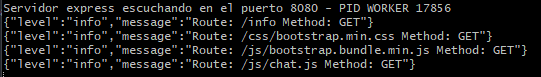
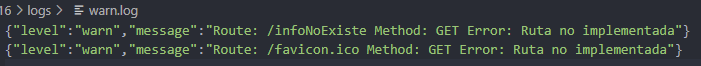

# LOGGERS Y GZIP

### Consigna parte 1
Incorporar al proyecto de servidor de trabajo la compresión gzip.

Verificar sobre la ruta /info con y sin compresión, la diferencia de cantidad de bytes devueltos en un caso y otro.

Luego implementar loggueo (con alguna librería vista en clase) que registre lo siguiente:
- Ruta y método de todas las peticiones recibidas por el servidor (info)
- Ruta y método de las peticiones a rutas inexistentes en el servidor (warning)
- Errores lanzados por las apis de mensajes y productos, únicamente (error)

Considerar el siguiente criterio:
- Loggear todos los niveles a consola (info, warning y error)
- Registrar sólo los logs de warning a un archivo llamada warn.log
- Enviar sólo los logs de error a un archivo llamada error.log

#### Solucion parte 1
Iniciamos servidor
```c
nodemon index.js -p 8080 -m FORK
```

Creamos rutas en otherRouter.js para verificar con y sin compresión:
```javascript
// Info json without gzip
router.get('/info-json', (req, res) => {
  res.json(getInfo());
});

// Info json with gzip
router.get('/info-json-gzip', compression(), (req, res) => {
  res.json(getInfo());
});
```

Implementamos loggeo con Winston en el archivo /utils/logger.js
```javascript
const winston = require('winston')

const logger = {
    level: 'info',
    format: winston.format.json(),
    transports: [
        new winston.transports.Console({ 
            level: 'info' 
        }),
        new winston.transports.File({
            filename: './logs/warn.log',
            level: 'warn',
        }),
        new winston.transports.File({
            filename: './logs/error.log',
            level: 'error',
        }),
    ],
}

module.exports = logger;
```

Logeamos info para todas las consultas
```javascript
    // log on every request
    app.use((req, res, next)=> {
        logger.info(`Route: ${req.originalUrl} Method: ${req.method}`);
        next();
    })
```



Logeamos warning para rutas inexistentes que se guardarn en el archivo /logs/warn.log
```javascript
// Fail
const failRoute = (req, res) => {
    logger.warn(`Route: ${req.originalUrl} Method: ${req.method} Error:${err}`);
    res.status(404).json({error: 'Ruta no implementada'});
};
```

Logeamos error en varios puntos que se guardarn en el archivo /logs/error.log
```javascript
logger.error(`Error: ${error}`);
```




### Consigna parte 2

Luego, realizar el análisis completo de performance del servidor con el que venimos trabajando.

Vamos a trabajar sobre la ruta '/info', en modo fork, agregando ó extrayendo un console.log de la información colectada antes de devolverla al cliente. Además desactivaremos el child_process de la ruta '/randoms'

Para ambas condiciones (con o sin console.log) en la ruta '/info' OBTENER:
1. El perfilamiento del servidor, realizando el test con --prof de node.js. Analizar los resultados obtenidos luego de procesarlos con --prof-process.

Utilizaremos como test de carga Artillery en línea de comandos, emulando 50 conexiones concurrentes con 20 request por cada una. Extraer un reporte con los resultados en archivo de texto.

Luego utilizaremos Autocannon en línea de comandos, emulando 100 conexiones concurrentes realizadas en un tiempo de 20 segundos. Extraer un reporte con los resultados (puede ser un print screen de la consola)

#### Solucion parte 2

Usaremos la ruta /info-json para generar el informe:
```c
node --prof index.js
artillery quick -c 50 -n 20 "http://localhost:8080/info-json" > artillery_sin_console.txt
// renombramos el archivo isolate a sin-v8.log
```

Agregamos el console.log() a la ruta y generamos archivo:
```c
node --prof index.js
artillery quick -c 50 -n 20 "http://localhost:8080/info-json" > artillery_con_console.txt
// renombramos el archivo isolate a con-v8.log
```

Procesamos los archivos:
```c
node --prof-process sin-v8.log  > result_prof_sin.txt
node --prof-process con-v8.log  > result_prof_con.txt
```

Con autocannon usamos el siguiente comando con y sin console log:
```c
autocannon -c 100 -d 20 "http://localhost:8080/info-json"
```

*Nota: Las imágenes se encuentran en /docs/informe.pdf*

### Consigna parte 3

2. El perfilamiento del servidor con el modo inspector de node.js --inspect. Revisar el tiempo de los procesos menos performantes sobre el archivo fuente de inspección.

3. El diagrama de flama con 0x, emulando la carga con Autocannon con los mismos parámetros anteriores.
Realizar un informe en formato pdf sobre las pruebas realizadas incluyendo los resultados de todos los test (texto e imágenes).

👉 Al final incluir la conclusión obtenida a partir del análisis de los datos.

#### Solucion parte 3

Perfilamos con inspect:
```c
node --inspect index.js
// abrimos chrome://inspect
artillery quick -c 50 -n 20 "http://localhost:8080/info-json" > inspect_con_console.txt

// detenemos el proceso, quitamos el console log y volvemos a iniciarlo
artillery quick -c 50 -n 20 "http://localhost:8080/info-json" > inspect_sin_console.txt
```

Para el diagrama de flama:
```c
0x index.js
autocannon -c 100 -d 20 "http://localhost:8080/info-json"

// detenemos el proceso, quitamos el console log y volvemos a iniciarlo
autocannon -c 100 -d 20 "http://localhost:8080/info-json"
```

*Nota: Las imágenes se encuentran en /docs/informe.pdf*

### Rutas principales

| Ruta         | Función     |
|--------------|-----------|
| / | Login |
| /signup | Crear una cuenta |
| /logout | Cerrar sesión |
| /productos | Listado de productos con chat |

### Otras rutas
| Ruta         | Función     |
|--------------|-----------|
| /info | Listado de valores usados por node.js |
| /info-json | Listado de valores usados por node.js en formato json |
| /info-json-gzip | Listado de valores usados por node.js en formato json con compress|
| /api/randoms | Devuelve un objeto de valores aleatorios de acuerdo al parámetro "cant", Ej. /api/randoms?cant=200. |


### Notas
Por default, los usuarios usan mongodb y se conecta a una base de datos llamada "ecommerce" en **mongodb://127.0.0.1:27017/ecommerce**
Para cambiar esta conexión se requiere crear un archivo .env en el root del proyecto y agregar una variable llamada **MONGO_URI**
Se puede cambiar el puerto para el servidor express agregando una variable con nombre **PORT**

Variables contempladas en el archivo .env :
- MONGO_URI=
- PORT=
