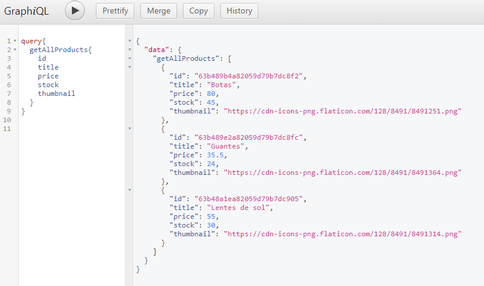
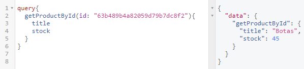
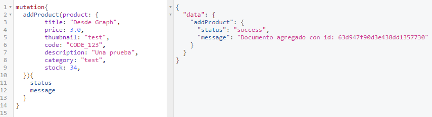
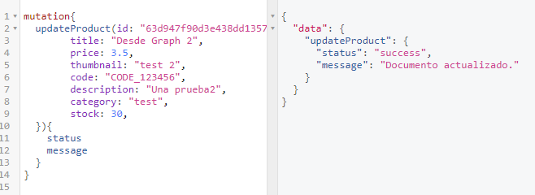
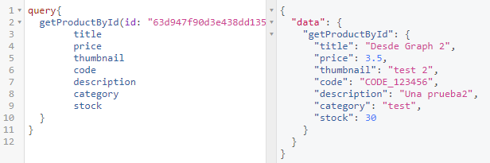
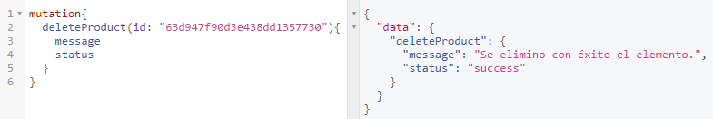

# REFORMAR PARA USAR GRAPHQL

### Consigna
- En base al último proyecto entregable de servidor API RESTful, reformar la capa de routeo y el controlador para que los requests puedan ser realizados a través del lenguaje de query GraphQL.
- Si tuviésemos un frontend, reformarlo para soportar GraphQL y poder dialogar apropiadamente con el backend y así realizar las distintas operaciones de pedir, guardar, actualizar y borrar recursos.
- Utilizar GraphiQL para realizar la prueba funcional de los querys y las mutaciones.

### Solución:

Creamos una carpeta *graphql* con la configuración necesaria para activar graphql.

Accediendo a la ruta /graphql podemos interactuar con GraphiQL:

```c
http://localhost:8080/graphql
```

Query para todos los productos:




Query para un producto:




Mutation para agregar un producto:




Mutation para actualizar el producto:




Query para revisar el producto actualizado:




Mutation para borrar el producto:




### Notas:
Para iniciar el proyecto en modo cluster se usa:
```c
nodemon index.js -m CLUSTER
```

Alternativamente, se usa una variable en un archivo .env llamada USE_CLUSTER=1

Hay una variable en el modelo de los usuarios llamada **is_admin**, de ser valor "true" se acceden a rutas de administrador y nuevas opciones.

Por default se conecta a una base de datos llamada "ecommerce" en **'mongodb://127.0.0.1:27017/ecommerce**
Para cambiar esta conexión se requiere crear un archivo .env en el root del proyecto y agregar una variable llamada **MONGO_URI**
Se puede cambiar el puerto para el servidor express agregando una variable con nombre **PORT**

En caso de requerir firebase se requieren las siguientes variables en el archivo .env :

- PORT= *por default 8080*
- MONGO_UR= *por default mongodb://127.0.0.1:27017/ecommerce* 
- USE_CLUSTER= *por default 0* 
- ADMIN_EMAIL= *cuenta de gmail que mandará el correo* 
- ADMIN_EMAIL_PASS= *pass de la app de gmail* 
- NOTIFICATIONS_EMAIL= *cuenta de correo donde llegarán los mensajes, puede ser la misma que ADMIN_EMAIL*
- IGNORE_TWILIO= *Agregar para ignora crear mensajes de SMS y whatsapp*
- TWILIO_ID=
- TWILIO_TOKEN=
- TWILIO_FROM_NUMBER=
- TWILIO_TO_NUMBER=
- TWILIO_WHATSAPP_FROM_NUMBER= *en formato  whatsapp:+XXXXXXXXXX*
- TWILIO_WHATSAPP_TO_NUMBER= *en formato  whatsapp:+XXXXXXXXXX*

## Rutas principales:
La tercera entrega contiene una interfaz con handlebars. Por default, las rutas de acceso son las siguientes:

| Ruta         | Función     |
|--------------|-----------|
| http://localhost:8080| Login de usuario|
| http://localhost:8080/signup| Signup de usuario|
| http://localhost:8080/productos/:id?| Listado de productos, un administrador puede modificar el inventario de productos|
| http://localhost:8080/carrito| Los productos agregados al carrito|
| http://localhost:8080/ordenes| Las ordenes generadas por el usuario|
| http://localhost:8080/ordenes/admin| Las ordenes generadas por todos los usuarios, únicamente para usuarios administradores|
| http://localhost:8080/extra/info| Configuración del servidor|

## Rutas API:
El router base '/api/productos' implementa cuatro funcionalidades:
- GET: '/:id?' - Me permite listar todos los productos disponibles ó un producto por su id
- POST: '/' - Para incorporar productos al listado
- PUT: '/:id' - Actualiza un producto por su id
- DELETE: '/:id' - Borra un producto por su id
- GET: 'categoria/:category?' - Me permite listar todos los productos disponibles ó un producto que pertenezcan a una categoria

