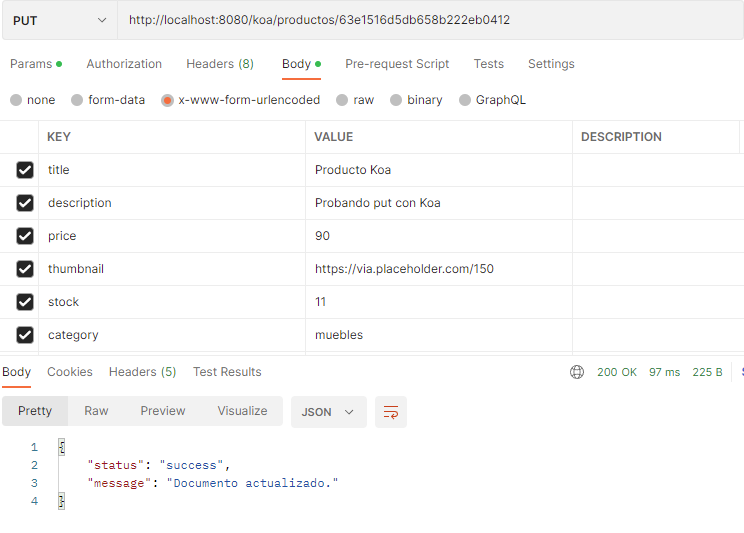

# REFORMAR PARA USAR OTRO FRAMEWORK (desafio 23) 
### Consignas
Elegir uno de los frameworks vistos en clase y trasladar a esta nueva plataforma el último proyecto entregable (con GraphQL) o al anterior (sin GraphQL).

- Verificar el correcto funcionamiento del servidor a nivel de sus rutas, vistas, lógica de negocio y persistencia.

### Pruebas

Corremos el archivo *indexKoa.js* 

```c
nodemon indexKoa.js
```

Accediendo a la ruta /koa/productos podemos interactuar con la API:

```c
http://localhost:8080/koa/productos
```

Todos los productos:


Agregamos un producto:


Comprobamos el producto agregado:


Modificamos producto:



Eliminamos producto:


### Notas:

Por default se conecta a una base de datos llamada "ecommerce" en **'mongodb://127.0.0.1:27017/ecommerce**
Para cambiar esta conexión se requiere crear un archivo .env en el root del proyecto y agregar una variable llamada **MONGO_URI**
Se puede cambiar el puerto para el servidor express agregando una variable con nombre **PORT**

En caso de requerir firebase se requieren las siguientes variables en el archivo .env :

- PORT= *por default 8080*
- MONGO_UR= *por default mongodb://127.0.0.1:27017/ecommerce* 
- USE_CLUSTER= *por default 0* 
- ADMIN_EMAIL= *cuenta de gmail que mandará el correo* 
- ADMIN_EMAIL_PASS= *pass de la app de gmail* 
- NOTIFICATIONS_EMAIL= *cuenta de correo donde llegarán los mensajes, puede ser la misma que ADMIN_EMAIL*
- IGNORE_TWILIO= *Agregar para ignora crear mensajes de SMS y whatsapp*
- TWILIO_ID=
- TWILIO_TOKEN=
- TWILIO_FROM_NUMBER=
- TWILIO_TO_NUMBER=
- TWILIO_WHATSAPP_FROM_NUMBER= *en formato  whatsapp:+XXXXXXXXXX*
- TWILIO_WHATSAPP_TO_NUMBER= *en formato  whatsapp:+XXXXXXXXXX*


## Rutas Koa:
El router base '/koa/productos' implementa cuatro funcionalidades:
- GET: '/:id?' - Me permite listar todos los productos disponibles ó un producto por su id
- POST: '/' - Para incorporar productos al listado
- PUT: '/:id' - Actualiza un producto por su id
- DELETE: '/:id' - Borra un producto por su id


